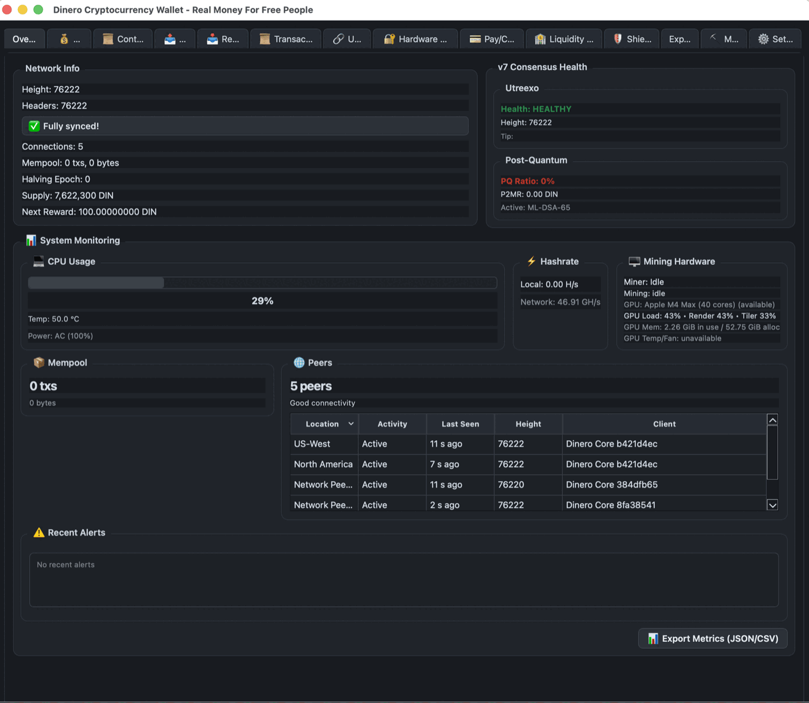
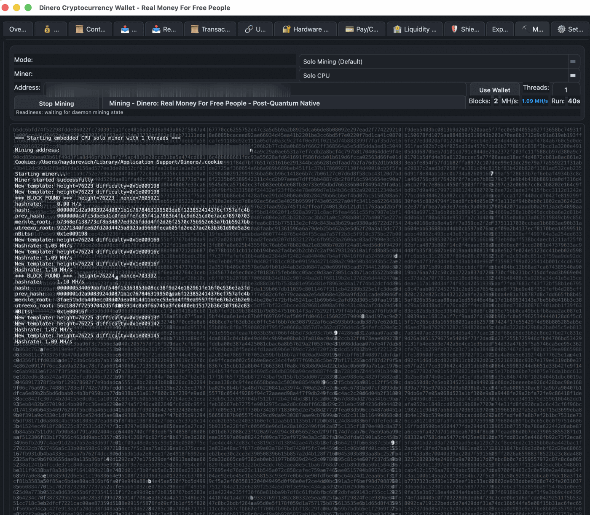
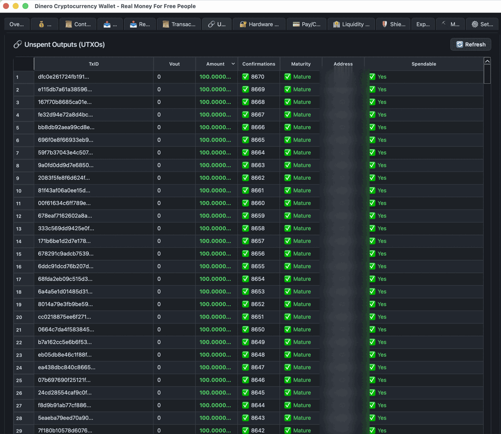
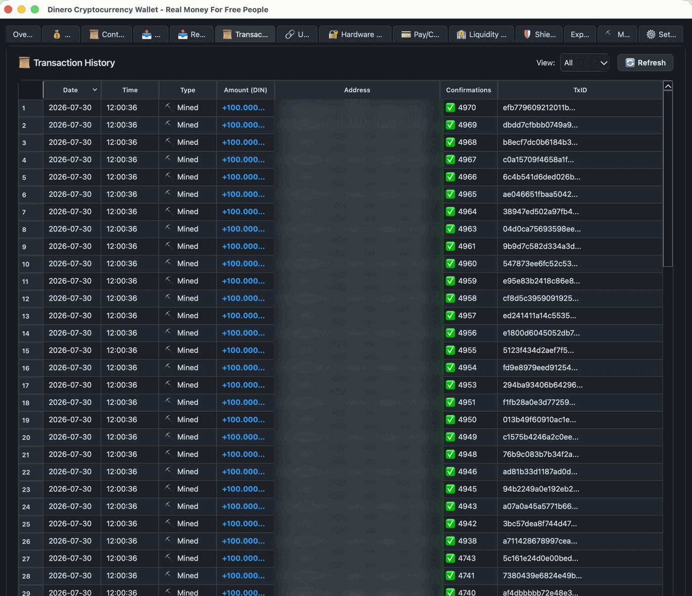

<h1 align="center">Dinero</h1>

<p align="center">
  <strong>A post-quantum, Utreexo-native proof-of-work cryptocurrency.</strong>
</p>

<p align="center">
  <a href="https://github.com/DineroLabs/dinero-v8/releases/latest"></a>
  <a href="https://github.com/DineroLabs/dinero-v8/releases/latest"></a>
  <a href="https://dinerolabs.org"></a>
  <a href="LICENSE"></a>
</p>

<p align="center">
  
</p>

Dinero accepts **NIST-standardized post-quantum signatures at the consensus
layer** — ML-DSA-65 (FIPS 204), valid since block 0 — and uses **Utreexo**
accumulators so a validating node proves coin existence from a compact
accumulator instead of maintaining a multi-gigabyte UTXO database. The same
validation logic runs inside mobile wallets through NodeCore, so the phone
verifies for itself rather than trusting a server.

## Why Dinero Is Different

| | |
|---|---|
| **Post-quantum at consensus** | ML-DSA-65 (NIST FIPS 204) is an accepted signature scheme from genesis — `activation_height = 0`. P2MR spends (witness v3) bind an ML-DSA-65 key to a Merkle commitment. Adoption is opt-in and still early; the point is that the consensus rules are already in place, not retrofitted after a quantum scare. |
| **Crypto-agility by design** | The signature scheme registry reserves slots for FALCON-512 and SPHINCS+-128s alongside ML-DSA-65, each with its own witness weight and verify cost, so adding or retiring a scheme is a registry change rather than a redesign. |
| **Utreexo at consensus** | Full validation without a UTXO database on disk. Not a layer, not an opt-in mode — it is the consensus rule. |
| **AssumeUTXO fast sync** | Signed snapshot anchors bring a new node to the tip quickly, then validate history forward in the background. |
| **~2-minute blocks** | `target_spacing = 120` seconds — roughly 720 blocks/day, with ASERT retargeting every `retarget_interval = 720` blocks. |
| **Taproot from block 1** | `taproot_scriptpath_activation_height = 1` on mainnet. No activation fork, no legacy script debt. |
| **Local validation on mobile** | NodeCore runs the same consensus code inside native wallets. |

## The Wallet

The Qt desktop wallet bundles a full node, solo and Stratum V2 mining, UTXO
inspection, and hardware wallet support.

<table>
  <tr>
    <td width="50%"><br><sub><strong>Built-in solo miner.</strong> Templates, difficulty, and found blocks stream live — including the Utreexo root committed in each header.</sub></td>
    <td width="50%"><br><sub><strong>Full UTXO visibility.</strong> Every output with confirmations, maturity, and spendability.</sub></td>
  </tr>
  <tr>
    <td colspan="2"><br><sub><strong>Transaction history</strong> with per-entry confirmation depth. <em>Addresses are redacted in these screenshots.</em></sub></td>
  </tr>
</table>

Dinero v8 is the current release lane for the daemon, CLI, Qt desktop wallet,
NodeCore mobile runtime, bridge/proof serving, and mining components.

If you are not building from source, start with [START_HERE.md](START_HERE.md)
or the current release page. The root file list is for developers and operators
working directly with the v8 source tree.

## Current Downloads

Use the current stable `v8.1.1` release from:

- [Dinero v8 releases](https://github.com/DineroLabs/dinero-v8/releases)
- [dinerolabs.org](https://dinerolabs.org)

Older `v2.x` and `v3.0.0-alpha` material is historical and should not be used
for new installs or fleet deployment.

## What Is In This Repo

- `dinerod` and `dinero-cli` for full nodes, bridge nodes, and operators
- Qt desktop wallet with embedded daemon and solo/SV2 mining controls
- NodeCore libraries used by mobile local-validation wallets
- Utreexo/AssumeUTXO sync, bridge proof serving, and block download scheduler
- CPU/GPU mining support and release packaging scripts

## v8 Node Modes

- **Operator / server nodes:** full validation from genesis unless an operator
  explicitly opts into snapshot-assisted bootstrap.
- **Bridge nodes:** serve block bodies and Utreexo/proof data to mobile clients.
- **Mobile NodeCore:** may use a bundled snapshot anchor for practical phone UX,
  then validates forward with headers, chainwork, Utreexo roots, and accumulator
  state.

## Quick Start

```bash
git clone https://github.com/DineroLabs/dinero-v8.git
cd dinero-v8
cmake -S . -B build
cmake --build build
```

For headless Linux/server installs, prefer the installer and release notes
published with the current stable release.

## Repository History

This public repository was cut from the v8 source line after older private
development history was retired. Historical v2/v3 documentation remains in the
tree where useful for protocol archaeology, but v8 releases are the current
source of truth.

## 🔒 Wallet Safety Certification

**DineroCoin wallets are exchange-grade safe** - empirically proven through comprehensive chaos engineering.

### Chaos Testing Results

Between January 8-9, 2026, DineroCoin executed **65 adversarial chaos cycles** across 4 independent risk surfaces with **zero fund loss, zero corruption, and zero data integrity failures**.

| Framework | Risk Surface | Cycles | Result |
|-----------|-------------|--------|--------|
| **Crash Chaos** | Process termination (SIGKILL) | 30 | ✅ PROVEN |
| **Spending Chaos** | Live fund spending | 25 | ✅ PROVEN |
| **Reorg Chaos** | Blockchain reorganizations | 5 | ✅ PROVEN |
| **Mempool Chaos** | Transaction evictions | 5 | ✅ PROVEN |
| **TOTAL** | **All risk surfaces** | **65** | ✅ **CERTIFIED** |

### Exchange-Grade Guarantees

✅ **No fund loss** - 100% fund conservation across all 65 cycles
✅ **No corruption** - Zero database corruption events
✅ **No rescans** - Clean recovery from all crash scenarios
✅ **State integrity** - All invariants preserved under adversarial conditions

### Documentation

📖 **[Comprehensive Test Results](docs/wallet/WALLET_CHAOS_TEST_RESULTS.md)** - Full certification report
📖 **[Chaos Testing Overview](tests/wallet/CHAOS_TESTING_OVERVIEW.md)** - Framework documentation
🔍 **Evidence Tags:** `v2.3.0-wallet-chaos`, `v2.4.0-wallet-spending-chaos`, `v2.5.0-wallet-reorg-chaos`, `v2.6.0-wallet-mempool-chaos`

---

## 🏛️ Architecture

DineroCoin is built on a **layered architecture** that ensures the integrity and compatibility of advanced features including Taproot, Covenants, Utreexo, Zero-Knowledge proofs, and Lightning Network.

### **Core Design Principles**

**Consensus remains authoritative.** All acceleration, compression, privacy, and off-chain mechanisms are designed to **never become authorities** themselves.

### **Architectural Documentation**

**For Contributors & Reviewers:**

All changes touching consensus, state representation, privacy, or off-chain protocols **must** comply with our architectural invariants:

📖 **[Layered Feature Compatibility](docs/architecture/layered_feature_compatibility.md)** (Normative)
- Defines fundamental layer separation rules
- Documents prohibited architectural patterns
- Establishes mandatory invariants

📚 **[Architecture Index](docs/architecture/README.md)**
- Complete architectural documentation
- Normative documents
- Compliance requirements

### **Layer Model**

| Layer | Responsibility | Examples |
|-------|----------------|----------|
| **Layer 0** | Consensus rules | Taproot, Covenants, Script validation |
| **Layer 1** | State representation | Utreexo, AssumeUTXO |
| **Layer 2** | Privacy | Zero-Knowledge proofs, Confidential Transactions |
| **Layer 3** | Off-chain protocols | Lightning Network |
| **Layer 4** | UX optimizations | Wallet features |

### **Mandatory Invariants**

1. **Lower layers never trust higher layers**
2. **Higher layers never weaken lower layers**

These invariants prevent architectural drift and ensure that advanced features remain compatible and secure.

---

## 🚀 Quick Start

### **1. Start the Daemon**
```bash
# Foreground regtest node, using the v8 regtest RPC default (20996).
dinerod -regtest -daemon=0 -server=1

# The daemon writes the effective RPC/P2P/cookie paths here.
cat ~/.dinero/regtest/nodeinfo.json
```

If you need fixed custom ports for a multi-node test, pass them explicitly:

```bash
dinerod -regtest -daemon=0 -server=1 -rpcport=20996 -port=20999
```

### **2. Create Your First Wallet**
```bash
# Create an HD wallet for this regtest datadir.
dinero-cli -regtest wallet.createhd my_wallet
```

### **3. Generate Your First Address**
```bash
# Generate a wallet address. The RPC may return either a JSON string or
# an object with an address field, depending on the active wallet backend.
ADDRESS=$(dinero-cli -regtest wallet.getnewaddress | jq -r '.address // .')
echo "New address: $ADDRESS"

# Validate address ownership
dinero-cli -regtest wallet.validateaddress "$ADDRESS"
```

### **4. Start Mining**
```bash
# Set wallet-owned mining address
dinero-cli -regtest mining.setaddress "$ADDRESS"

# Verify mining configuration
dinero-cli -regtest mining.getaddress

# Generate test blocks immediately (regtest only)
dinero-cli -regtest generatetoaddress 10 "$ADDRESS"

# Start mining with 1 thread
dinero-cli -regtest mining.start 1

# Check status, then stop mining
dinero-cli -regtest mining.info
dinero-cli -regtest mining.stop
```

---

## 🏗️ Building the System

### **Prerequisites**
- macOS (arm64) with Xcode
- Qt 6.9.1 installed at `$HOME/Qt/6.9.1/macos`
- CMake 3.10+

### **Build Commands**

#### **Release Build (Production)**
```bash
cmake -S . -B build -DCMAKE_BUILD_TYPE=Release \
  -DCMAKE_PREFIX_PATH="$HOME/Qt/6.9.1/macos" -DENABLE_SANITIZERS=OFF
cmake --build build -j8
```

#### **Debug Build (Development)**
```bash
cmake -S . -B build-asan -DCMAKE_BUILD_TYPE=Debug \
  -DCMAKE_PREFIX_PATH="$HOME/Qt/6.9.1/macos" -DENABLE_SANITIZERS=ON
cmake --build build-asan -j8
```

#### **Build Specific Targets**
```bash
# Build just the daemon
cmake --build build --target dinerod

# Build just the Qt app
cmake --build build --target dinero-simple-test

# Build everything
cmake --build build
```

---

## ⚡ Daily Usage Commands

### **🚀 Starting the System**

#### **Start Daemon (Background)**
```bash
./build/bin/dinerod -datadir=./data -rpcport=20998 -port=20999 -daemon=1 -server=1
```

#### **Start Daemon (Foreground - see logs)**
```bash
./build/bin/dinerod -datadir=./data -rpcport=20998 -port=20999 -daemon=0 -server=1
```

#### **Start Qt GUI**
```bash
./build/bin/dinero-simple-test
```

### **🛑 Stopping the System**

#### **Stop Daemon Gracefully**
```bash
# Find daemon PID
ps aux | grep dinerod | grep -v grep

# Kill by PID
kill <PID>

# Force kill if needed
kill -9 <PID>
```

#### **Stop All Dinero Processes**
```bash
# Kill all dinerod and Qt processes
pkill -f "dinerod|dinero-"

# Force kill all
pkill -9 -f "dinerod|dinero-"
```

### **🧹 Cleanup Commands**

#### **Clean All Databases and Restart Fresh**
```bash
# Stop all processes
pkill -f "dinerod|dinero-"

# Remove all database files
rm -f data/*.db* data/*.db-shm data/*.db-wal

# Remove lock files
find data/ -name "*LOCK*" -type f -delete

# Start fresh
./build/bin/dinerod -datadir=./data -rpcport=20998 -port=20999 -daemon=0 -server=1
```

---

## 🏦 Wallet Management

### **Creating Wallets**

#### **Create New Wallet**
```bash
dinero-cli wallet.createhd wallet_name
```

#### **Create Multiple Wallets**
```bash
# Personal wallet
dinero-cli wallet.createhd personal

# Business wallet
dinero-cli wallet.createhd business
```

### **Generating Addresses**

#### **Generate Single Address**
```bash
dinero-cli wallet.getnewaddress
```

#### **Generate Multiple Addresses**
```bash
# Generate 5 addresses
for i in {1..5}; do
  dinero-cli wallet.getnewaddress
done
```

### **Wallet Information**

#### **Check Wallet Status**
```bash
# Get blockchain info (includes wallet status)
curl -s --user "__cookie__:$(cat data/.cookie)" \
  --data-binary '{"jsonrpc": "1.0", "id": "test", "method": "getblockchaininfo", "params": []}' \
  -H 'content-type: text/plain;' http://127.0.0.1:20998/
```

---

## ⛏️ Mining Operations

### **Mining Setup**

#### **Set Mining Address**
```bash
# Replace YOUR_ADDRESS_HERE with your actual address
dinero-cli mining.setaddress YOUR_ADDRESS_HERE
```

#### **Start Mining**
```bash
# Start mining with 1 thread
dinero-cli mining.start 1

# Start mining with 4 threads (adjust based on your CPU)
dinero-cli mining.start 4
```

#### **Stop Mining**
```bash
dinero-cli mining.stop
```

### **Mining Monitoring**

#### **Get Mining Info**
```bash
dinero-cli mining.info
```

#### **Check Mining Status**
```bash
dinero-cli mining.info | jq '.mining // .is_mining // .mining_enabled'
```

---

## 🔗 RPC API Reference

### **Blockchain Information**

#### **Get Blockchain Info**
```bash
curl -s --user "__cookie__:$(cat data/.cookie)" \
  --data-binary '{"jsonrpc": "1.0", "id": "test", "method": "getblockchaininfo", "params": []}' \
  -H 'content-type: text/plain;' http://127.0.0.1:20998/
```

#### **Get Block Count**
```bash
curl -s --user "__cookie__:$(cat data/.cookie)" \
  --data-binary '{"jsonrpc": "1.0", "id": "test", "method": "getblockcount", "params": []}' \
  -H 'content-type: text/plain;' http://127.0.0.1:20998/
```

#### **Get Best Block Hash**
```bash
curl -s --user "__cookie__:$(cat data/.cookie)" \
  --data-binary '{"jsonrpc": "1.0", "id": "test", "method": "getbestblockhash", "params": []}' \
  -H 'content-type: text/plain;' http://127.0.0.1:20998/
```

### **Network Information**

#### **Get Connection Count**
```bash
curl -s --user "__cookie__:$(cat data/.cookie)" \
  --data-binary '{"jsonrpc": "1.0", "id": "test", "method": "getconnectioncount", "params": []}' \
  -H 'content-type: text/plain;' http://127.0.0.1:20998/
```

#### **Get Network Info**
```bash
curl -s --user "__cookie__:$(cat data/.cookie)" \
  --data-binary '{"jsonrpc": "1.0", "id": "test", "method": "getnetworkinfo", "params": []}' \
  -H 'content-type: text/plain;' http://127.0.0.1:20998/
```

---

## 🛠️ Troubleshooting

### **Common Issues & Solutions**

#### **"No wallet is loaded" Error**
```bash
# Solution: Create a wallet first
dinero-cli wallet.createhd default
```

#### **"Unauthorized" RPC Error**
```bash
# Check if cookie file exists and has correct format
cat data/.cookie

# Should show: __cookie__:long_hex_string
# If missing or wrong format, restart daemon
```

#### **Port Already in Use**
```bash
# Check what's using the port
lsof -i :20998

# Kill the process using the port
kill -9 <PID>

# Or use different ports
./build/bin/dinerod -datadir=./data -rpcport=20998 -port=20999 -daemon=0 -server=1
```

#### **Database Locked**
```bash
# Clean shutdown and restart
pkill -f "dinerod|dinero-"
sleep 2
rm -f data/*.db* data/*.db-shm data/*.db-wal
find data/ -name "*LOCK*" -type f -delete
# Then restart daemon
```

### **Debug Commands**

#### **Check Daemon Status**
```bash
# Check if daemon is running
ps aux | grep dinerod | grep -v grep

# Check if daemon is listening
lsof -i :20998

# Check daemon logs (if running in foreground)
# Look for error messages in terminal
```

#### **Check Database Files**
```bash
# List all database files
ls -la data/ | grep -E "\.(db|db-shm|db-wal)"

# Check file sizes
du -h data/*.db*
```

---

## 📁 File Structure

### **Data Directory (`./data/`)**
```
data/
├── .cookie                    # RPC authentication
├── dinero.conf               # Daemon configuration
├── explorer.db               # Explorer database (read-only analytics layer)
├── wallet.db                 # Wallet database
├── mempool.db                # Transaction mempool
├── peers.db                  # Peer connections
├── blockchain_data/          # Blockchain storage
├── mainnet/                  # Mainnet data
└── regtest/                  # Regtest data
```

### **Build Directory (`./build/`)**
```
build/
├── bin/
│   ├── dinerod               # Main daemon
│   ├── dinero-simple-test    # Qt GUI app
│   └── dinero-cli            # Command line interface
└── lib/                      # Libraries
```

---

## 🔧 Advanced Configuration

### **Configuration File (`data/dinero.conf`)**
```ini
# RPC authentication
rpcuser=dinero_user
rpcpassword=dinero_pass_123456

# Network settings
listen=1
port=20999
rpcport=20998

# Server mode
server=1

# Mining settings
gen=0

# Debug logging
debug=net
debug=addrman

# Connection settings
maxconnections=8
timeout=5000
```

### **Environment Variables**
```bash
# Set data directory
export DINERO_DATA_DIR="./data"

# Set RPC port
export DINERO_RPC_PORT=20998

# Set network
export DINERO_NETWORK=mainnet
```

---

## 🎯 **Quick Reference Card**

### **Essential Commands (Copy & Paste)**
```bash
# Start daemon
./build/bin/dinerod -datadir=./data -rpcport=20998 -port=20999 -daemon=0 -server=1

# Create HD wallet
./build/bin/dinero-cli -datadir=./data wallet.createhd my_wallet

# Generate address
ADDRESS=$(./build/bin/dinero-cli -datadir=./data wallet.getnewaddress | jq -r '.address // .')

# Start mining
./build/bin/dinero-cli -datadir=./data mining.setaddress "$ADDRESS"
./build/bin/dinero-cli -datadir=./data mining.start 1

# Stop everything
./build/bin/dinero-cli -datadir=./data mining.stop
pkill -f "dinerod"
```

---

## What You Have Running

At this point you have exercised the core Dinero v8 daemon/CLI flow:

- Generate wallet receive addresses
- Create and manage HD wallets
- Check chain, wallet, network, and mining status
- Run local test mining when using regtest
- Use the same RPC surfaces that the mainnet v8 release line exposes

For mainnet or operator deployments, use the current stable release
from the Dinero v8 releases page and verify the published checksums.

---

## 📞 Support & Community

- **GitHub Repository:** https://github.com/DineroLabs/dinero-v8
- **Issue Tracker:** https://github.com/DineroLabs/dinero-v8/issues
- **Downloads:** https://github.com/DineroLabs/dinero-v8/releases
- **Website:** https://dinerolabs.org

---

*Last updated: July 28, 2026*
*Dinero Version: **v8.1.1 stable***
*Release: [Dinero v8 releases](https://github.com/DineroLabs/dinero-v8/releases)*
