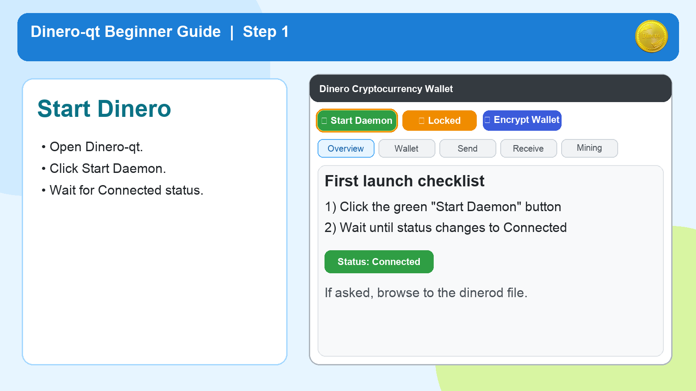
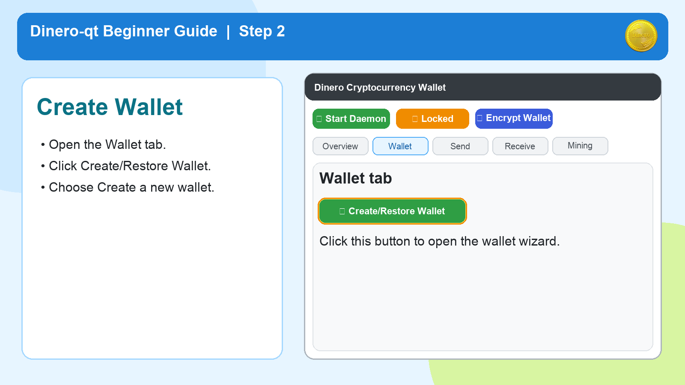
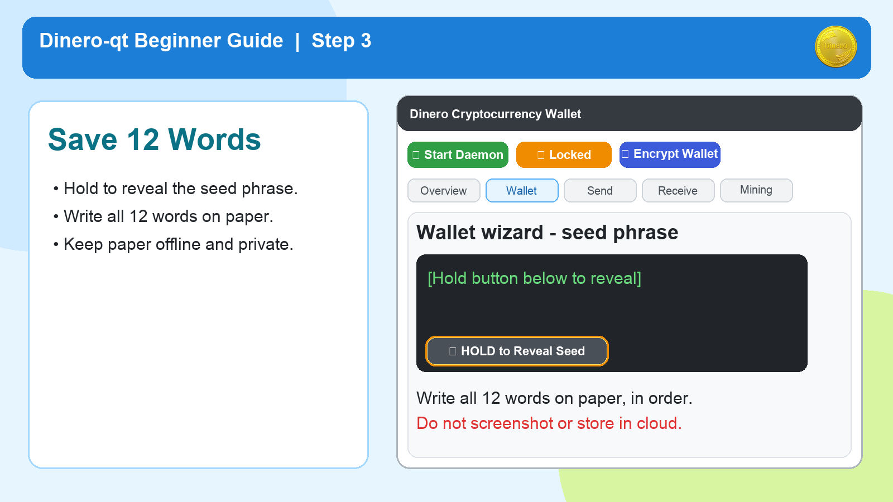
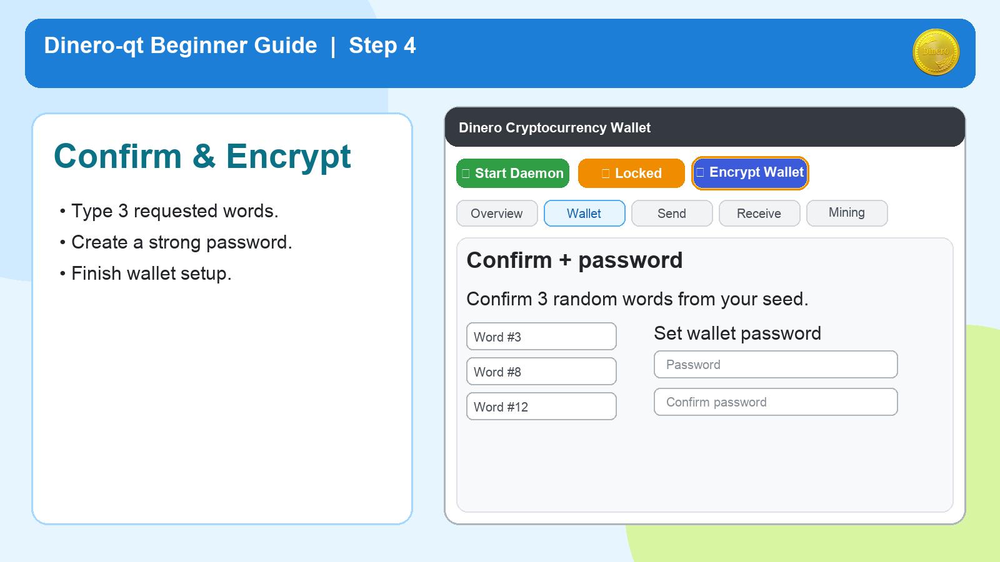
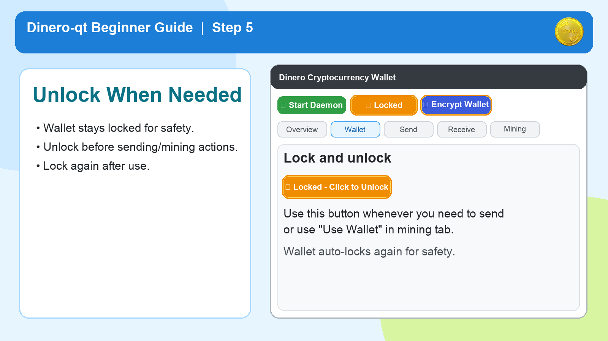
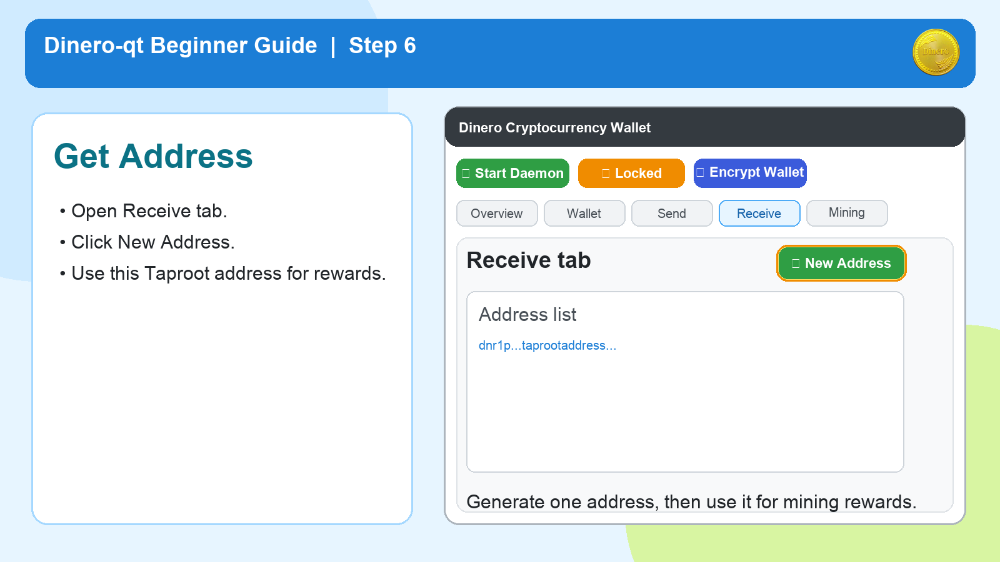
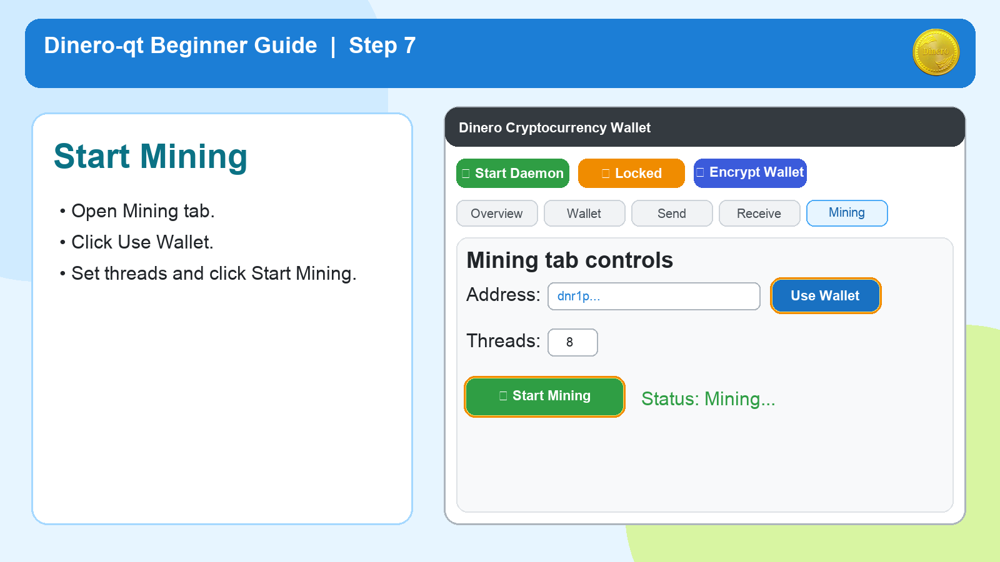
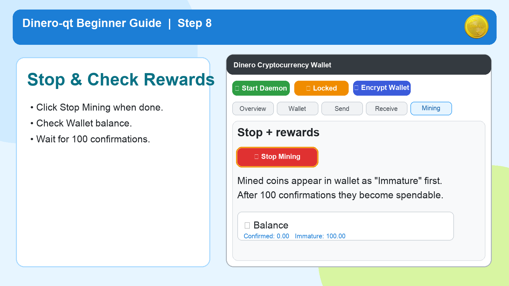

# Dinero-qt Simple Guide (For Non-Technical Users)

This guide is for the **newest Dinero-qt**.

`Important:` In this version, the **daemon and miner are embedded** in the app. You do not need separate daemon/miner setup.

---

## 1. Open Dinero-qt and Start It

- Open `Dinero-qt`.
- Click **Start Daemon**.
- Wait until status shows connected.

---

## 2. Create Your Wallet

- Open the **Wallet** tab.
- Click **Create/Restore Wallet**.
- Choose **Create a new wallet**.

---

## 3. Save Your 12 Secret Words

- In wallet setup, hold **HOLD to Reveal Seed**.
- Write all **12 words** on paper, in the exact order.
- Store this paper in a safe place.

`Never do this:`
- No screenshots
- No cloud notes
- No sending it to anyone

---

## 4. Confirm Words and Set Password

- Enter the requested seed words to confirm backup.
- Create a strong wallet password.
- Finish setup.

---

## 5. Unlock Only When Needed

- Your wallet should stay locked most of the time.
- Click the lock button to unlock when you need actions like sending or using wallet address in mining.
- Lock again after use.

---

## 6. Generate a Receiving Address

- Open the **Receive** tab.
- Click **New Address**.
- This address is where mining rewards go.

---

## 7. Start Mining (Embedded Miner)

- Open the **Mining** tab.
- Click **Use Wallet** (fills your mining address).
- Keep default threads (or set your own).
- Click **Start Mining**.

---

## 8. Stop Mining and Check Rewards

- Click **Stop Mining** when you want to stop.
- Open **Wallet** tab to watch balances.
- New mining rewards appear first as immature, then become spendable after confirmations.

---

## Quick Help

- `Start Mining` button is disabled:
  - Click **Start Daemon** and wait for connection.
- `Use Wallet` is disabled:
  - Unlock wallet first.
- No spendable reward yet:
  - Wait for required confirmations.

---

## Security Checklist

- I wrote down my 12 words on paper.
- I stored the paper in a safe location.
- I set a strong password.
- I never shared seed words with anyone.

