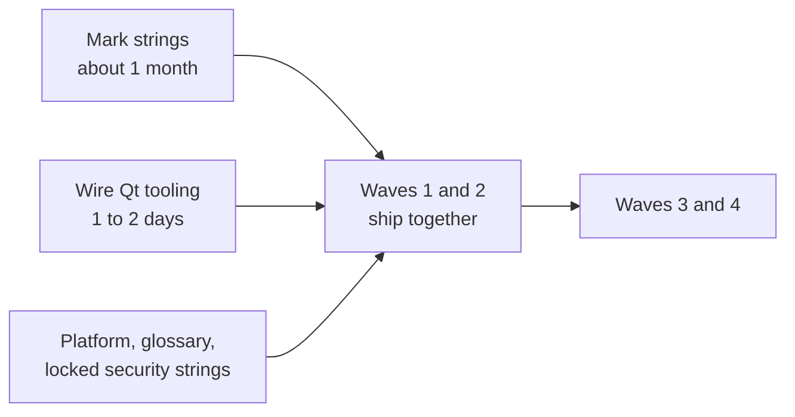

# dinero-qt Multi-Language Plan

2026-09-24

Shared doc: https://claude.ai/code/artifact/bfeb8507-8d69-4dd3-9c97-91f9c5b6d8db

The Qt plumbing and the Settings language picker are one to two days of work. The real cost is that the wallet GUI has almost no translation markup today, so roughly 1,000 to 2,000 user-visible strings across 44,700 lines have to be marked by hand first.

## Where the code stands

The GUI that ships is built from this `qt/` subdirectory of the dinero-v8 monorepo, not from the older standalone dinero-qt repository. The release build passes `-DDINERO_BUILD_QT=ON`, which adds this subdirectory and produces the `dinero-qt` target, and `packaging/mac/assert-v8-release-lane.sh` enforces it. The standalone repository is pre-monorepo, last committed in June 2026, and is not shipped.

This tree has no translation infrastructure and almost no translation markup:

| Measure | Value |
| --- | ---: |
| UI source | 44,720 lines, 60 .cpp and 47 .h |
| tr() calls present | 87 |
| Strings from common setters | 776 |
| Message and dialog calls | 219 |
| Strings built by concatenation | 1,137 |
| Calls already using .arg() | 1,098 |
| Fixed width or size calls | 46 |

Working estimate: 1,000 to 2,000 user-visible strings. That range excludes stylesheets, RPC method names, log text and hex constants, which cannot be separated automatically. The 87 existing tr() calls cover a small fraction of the surface and are not a starting catalog.

Four structural facts shape the work:

- There are no Qt Designer form files, so there is no generated retranslate function. Live language switching would mean hand-writing refresh code for every widget.
- `mainwindow.cpp` is 15,820 lines, about a third of the tree, so much of the marking sits in one file.
- Settings is a tab built inline in that file, not a separate dialog.
- `QSettings` is already used 52 times, including a UI preference that reads with a default and writes on change. A language picker reuses that exact pattern.

No translation catalog exists in the tree, and the shipped 8.1.12 build carries no compiled translations.

## Decisions already locked

Six rules are settled and should not be reopened per language.

1. **English is the default and the source language.** No English catalog is maintained. A string with no entry in the loaded catalog falls back to its English source automatically, which is Qt's default behaviour, so partial coverage is usable and English cannot break from a bad catalog.
2. **Language changes only in the Settings window, with restart to apply.** This is what makes the absence of form files cheap: no per-widget refresh code is ever written.
3. **Words only. Amounts stay dot decimal in every language**, for both display and entry. Language selection must not drive locale number formatting. A comma decimal separator is a fund-loss risk, not a cosmetic one.
4. **No operating-system locale auto-detection.** A user in Germany sees English until they choose otherwise. Locale changes stay under the application's control.
5. **Terms with no sensible translation stay English.** The automatic fallback only covers missing entries; a wrong or nonsensical translation still displays. Deciding that a term has no translation is a human judgment, so it belongs in a glossary.
6. **Right-to-left languages are out of scope** for all waves. Layout mirroring is a separate project, not another entry in the language list.

## Language waves

Wave 2 ships immediately after wave 1, so the launch is effectively eleven languages rather than five.

| Wave | Languages |
| --- | --- |
| 1 | Spanish, Chinese (Simplified), Russian, Portuguese (Brazil), German |
| 2 | French, Turkish, Polish, Ukrainian, Japanese, Vietnamese |
| 3 | Italian, Dutch, Bosnian, plus Croatian and Serbian (Latin) |
| 4 | Swedish, Danish, Finnish, Hungarian, Bulgarian, Estonian, Latvian |

Why the groups fall this way:

- **Waves 1 and 2 are chosen for new users.** They cover the largest non-English crypto populations, the inflation-driven markets where self-custody demand is real, and the mining community.
- **Ukrainian is not covered by Russian.** Ukraine has high adoption and many users there will not accept a Russian interface. Shipping Russian without Ukrainian for an extended period is a visible choice that would need defending, which is why the two waves run back to back.
- **Bosnian brings Croatian and Serbian cheaply.** The three are mutually intelligible and share most of their text. Serbian in Cyrillic is a script conversion rather than a fresh translation, so one good translation yields close to three languages.
- **The Nordic languages and Dutch will not add users.** Those countries rank at the very top for English proficiency and their crypto users are already English-capable. The justification is different and still valid: people handle money in their mother tongue even when fluent in English.
- **Latvian ranks last on raw numbers.** Estonian earns its place partly through an unusually strong digital and fintech culture.
- **German is the layout canary.** German and Russian expand longest and will expose the 46 fixed-width calls before any other language does.

Traditional Chinese is a separate catalog, not a free variant of Simplified. Add it only if traffic justifies it. Korean is the obvious addition if wave 2 grows.

## Before wave 1 ships

Because wave 2 follows immediately, three things have to exist ahead of wave 1 rather than after it. Retrofitting any of them under load is worse than building it first.

- **A translation platform and contributors, not a vendor.** At eleven catalogs heading toward twenty, the dominant cost stops being translation and becomes synchronisation. Every release that adds strings multiplies across every catalog, and they drift out of date quietly. Contributors who can self-serve turn the per-release job into review instead of procurement.
- **The never-translate glossary.** Translators for both waves work in parallel, so terminology has to be settled once rather than renegotiated per language. It should list the product name, the ticker, address prefixes and protocol vocabulary. The cleanest protection is to keep those tokens out of translatable text entirely and pass them in as parameters, so a translator never sees them as something to change.
- **A locked set of security-critical strings.** This is a wallet. A wrong or hostile translation of an irreversibility warning, a fee confirmation or a seed-phrase caution can cost someone their coins. Community editing is appropriate for tab labels. It is not appropriate for the strings that stop people losing money, and those should be a small, explicitly marked set that only a reviewer can change.

One related constraint worth stating plainly: the recovery-phrase wordlist must stay decoupled from the interface language. Switching the interface to Spanish must not change the wordlist a seed is derived from or validated against, or existing backups will appear invalid.

## Effort and sequencing

Roughly one focused engineer-month to become translation-ready, and almost all of it is one-time. Translation cost sits on top of that, and a small permanent tax applies to every release afterwards.

The three inputs run in parallel; the string marking is the long pole and everything else fits inside it.

The work in order of cost:

1. **Mark the strings.** The bulk of the effort. Mechanical but needs judgment about what is user-facing, and much of it lives in one 15,820-line file.
2. **Convert the 1,137 concatenations into format strings.** Until this happens, translators cannot reorder words, and many languages need different word order than English.
3. **Fix the 46 fixed-width calls.** Use German as the canary, since it expands longest.
4. **Wire the Qt tooling and the Settings picker.** Genuinely small, and it reuses the existing preference pattern.
5. **Translate and review.** Capacity and money rather than engineering time.

Adding languages six through eleven costs almost no extra engineering. The marking is done once and is language-independent, so the incremental cost is translation and review capacity. The three East Asian languages need a font fallback check on Windows and Linux, which is where a clipped label looks worst.

Because untranslated strings fall back to English, a language can ship before it is complete. Translate by screen rather than scattering coverage: a fully English advanced panel beside a fully translated main tab reads as deliberate, while mixed language inside one screen reads as broken.

## Open items

Four things could still change this plan.

- **The wave ordering rests on judgment, not measured user geography.** GitHub release download geography is the best signal available today and costs nothing to look at. Explorer traffic is second. If either disagrees with the ordering, follow the data. Peer geography could not be read here because the shipped 8.1.12 build does not register the peer-info RPCs.
- **Whether wave 2 gains a tenth language.** Korean is the obvious candidate. Traditional Chinese is a separate decision and a separate catalog, warranted only if traffic shows it.
- **Whether the old standalone dinero-qt repository gets retired.** A pre-monorepo checkout still sits on disk on the `qt-main` branch, last committed in June 2026. It is not built and not shipped, but it looks like the GUI source, so anyone who edits it will see no effect on the product. Archiving or clearly labelling it would remove a real trap.
- **Who owns translation review per language.** The locked security strings need a named reviewer before any outside contributor touches a catalog, not after.
